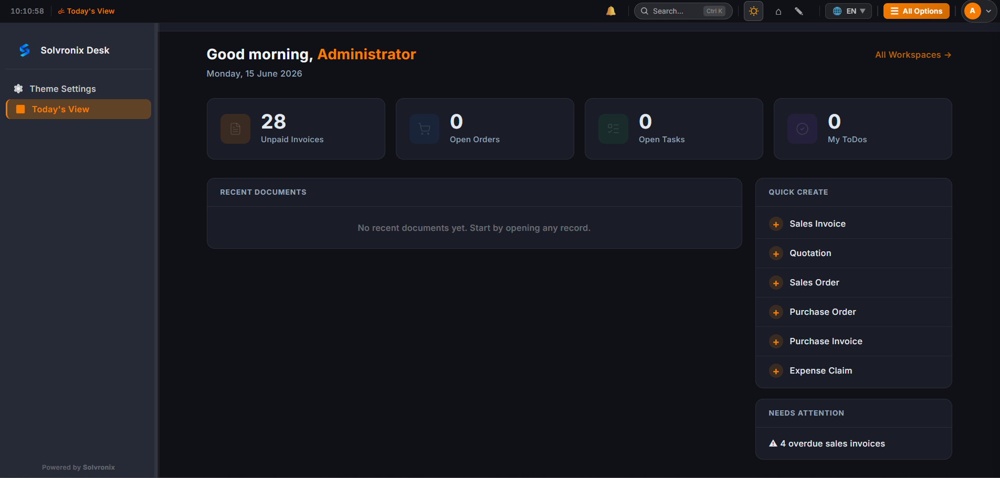
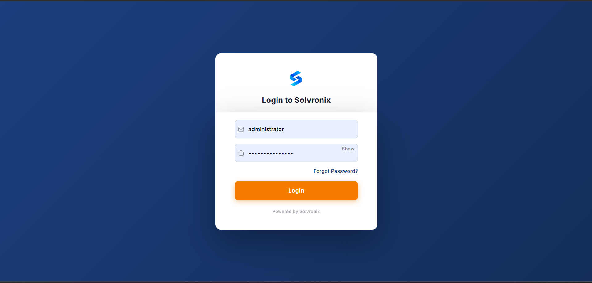
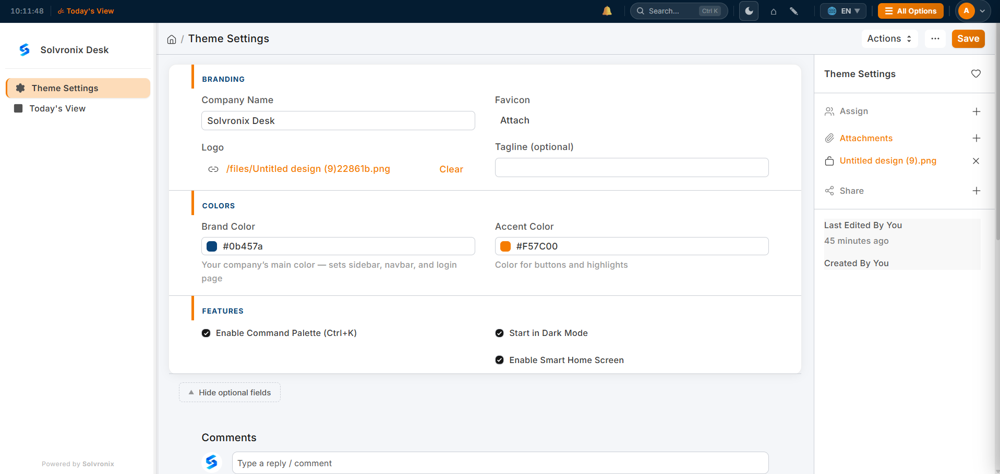
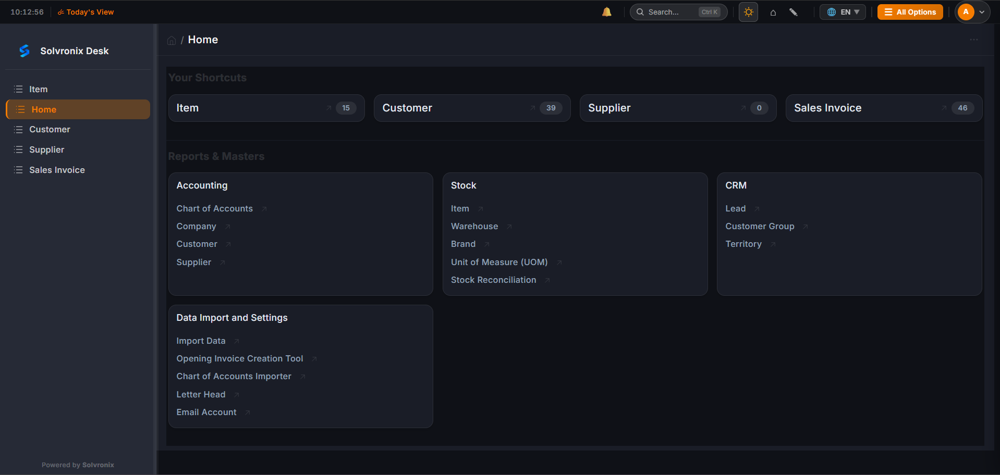
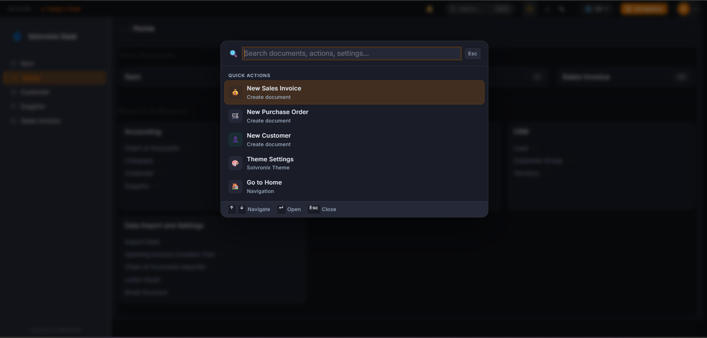
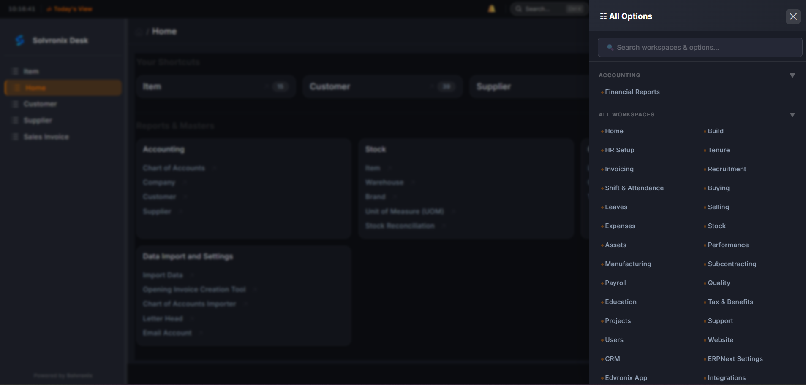

# Solvronix Desk

> A professional white-label theme for Frappe/ERPNext v16 that makes your ERP look and feel like a modern SaaS product.



---

## The Problem

ERPNext is powerful. But the default interface is overwhelming — too many menus, outdated design, and non-technical users struggle to find anything. Businesses reject ERPNext because it "doesn't look professional" or "is too hard to use."

**Solvronix Desk solves this.** Install it once and your ERPNext looks and feels like a tool people actually enjoy using — without touching a single line of your business logic.

---

## What You Get

### Command Palette — `Ctrl+K`
Press `Ctrl+K` from anywhere. Type what you're looking for — a document, a list, a setting — and navigate instantly. No menu hunting. No memorizing paths.

### White-Label Branding
Go to Theme Settings, enter your company name, upload your logo, pick your two brand colors. Save. The entire system — sidebar, navbar, login page, buttons — instantly becomes your brand.

### Auto Color System
You set one brand color. The system automatically generates your complete color palette — backgrounds, hover states, borders, shadows — using CSS `color-mix()`. Change your brand color and everything updates instantly. No developer needed.

### Slim Icon Sidebar
A 64px icon rail (like Slack) instead of the default wide sidebar. Expands to 240px on click. Saves screen space, reduces visual clutter. State is saved per user.

### Dark Mode
One click toggles between light and dark. Both modes respect your brand colors. Works on every page.

### Modern Login Page
A full-screen branded login experience with your company logo and colors. First impression that sets the right tone for your team.

---

## Screenshots

| Login Page | Today's View |
|:---:|:---:|
|  |  |

| Theme Settings | Dark Mode |
|:---:|:---:|
|  |  |

| Command Palette | Slim Sidebar |
|:---:|:---:|
|  |  |

---

## Requirements

| Requirement | Version |
|---|---|
| Frappe Framework | v16 |
| ERPNext | v16 (optional — works on any Frappe app) |
| Python | 3.10+ |
| Node | 18+ |

---

## Installation

**Step 1 — Download the app**
```bash
bench get-app https://github.com/Solvronix/Solvronix-Desk
```

**Step 2 — Install on your site**
```bash
bench --site your-site.com install-app solvronix_theme
```

**Step 3 — Build and restart**
```bash
bench build --app solvronix_theme
bench restart
```

**Step 4 — Open your site**

Go to `your-site.com/desk`. The theme is now active with default Solvronix colors.

---

## Setup Your Branding (5 minutes)

After installation, open **Theme Settings** — search for it with `Ctrl+K` or find it in the sidebar.

| Field | What it does |
|---|---|
| Company Name | Shown in the navbar — replaces "ERPNext" |
| Company Logo | Shown in the navbar and login page |
| Brand Color | Sets sidebar, navbar, and login page background |
| Accent Color | Sets buttons, active states, and highlights |

Click **Save** — the entire system updates instantly.

---

## How the Color System Works

You only need to pick **two colors**. Everything else is generated automatically.

```
Brand Color  →  sidebar background, navbar, login page
               + auto-generates: hover tints, border colors, page tint

Accent Color →  buttons, active sidebar item, highlights
               + auto-generates: button hover, pressed state
```

This means any company — whether their brand is navy, green, red, or black — gets a complete, consistent color system from just two color pickers.

**Example:** Set Brand Color to `#006B3C` (green). Sidebar becomes green, login page becomes green, page background becomes a very light green tint. Set it back to `#1B3F7E` (navy) and everything reverts. No code, no rebuild.

---

## Default Colors

| Color | Hex | Used For |
|---|---|---|
| Brand | `#1B3F7E` | Sidebar, navbar, login |
| Accent | `#F57C00` | Buttons, active items |
| Page Background | Auto-generated | Light tint of brand color |
| Cards / Forms | `#FFFFFF` | All content surfaces |

---

## Keyboard Shortcuts

| Key | Action |
|---|---|
| `Ctrl+K` / `Cmd+K` | Open command palette |
| `↑` `↓` | Move through results |
| `Enter` | Open selected item |
| `Esc` | Close palette |

---

## Compatibility

| Frappe Version | Status |
|---|---|
| v16 | ✅ Fully supported |
| v15 | ⚠️ Not tested |
| v14 | ❌ Not supported |

Works with ERPNext and any other Frappe-based application.

---

## Uninstalling

```bash
bench --site your-site.com uninstall-app solvronix_theme
bench build
bench restart
```

Your ERPNext returns to its default appearance. No data is deleted.

---

## License

MIT License — free to use, modify, and distribute commercially.

See [LICENSE](license.txt) for full details.

---

## About Solvronix

Solvronix builds Frappe/ERPNext products for businesses globally, based in Lahore, Pakistan.

- Website: [solvronix.com](https://solvronix.com)
- Email: sales@solvronix.com
- WhatsApp: +92 307 9484220

**Other products:**
- [Edvronix](https://solvronix.com/edvronix) — School management system built on ERPNext. Fee collection, attendance, timetables, parent portal, and more.

---

## Support

Something not working? Open an issue on [GitHub Issues](https://github.com/solvronix/solvronix_theme/issues) or contact us directly.

- Email: sales@solvronix.com
- WhatsApp: +92 307 9484220

---

## Contributing

Pull requests are welcome. For major changes, please open an issue first to discuss what you'd like to change.
