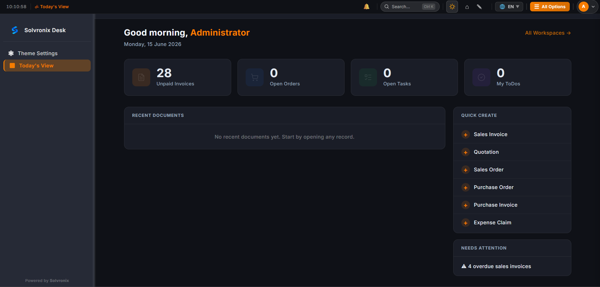
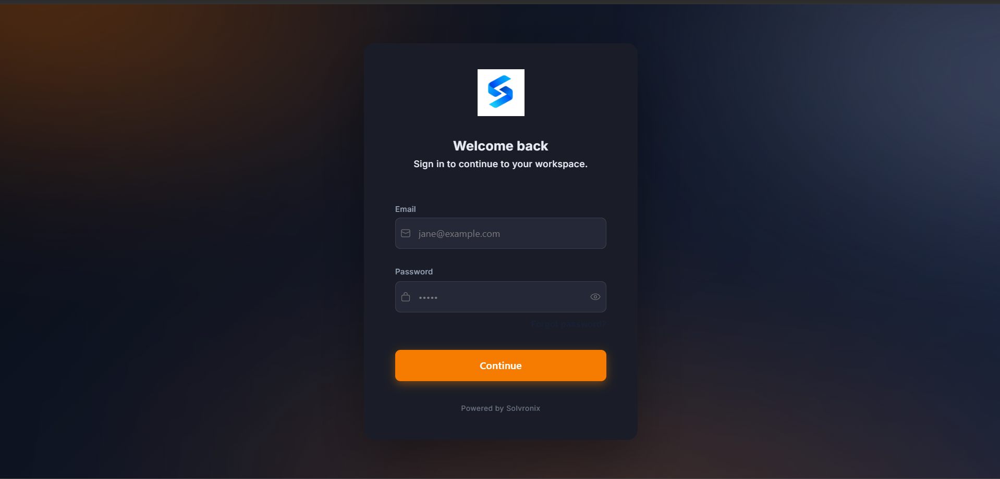
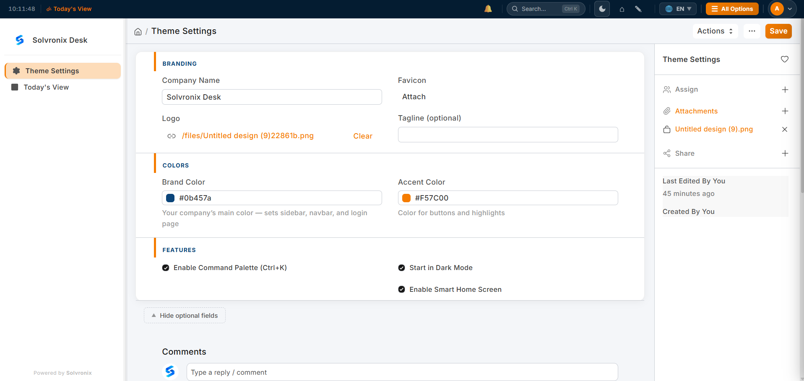
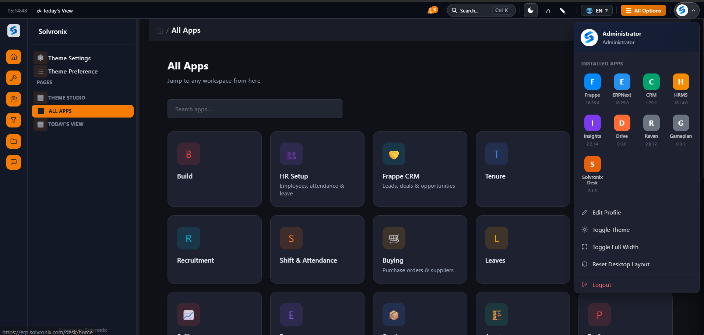
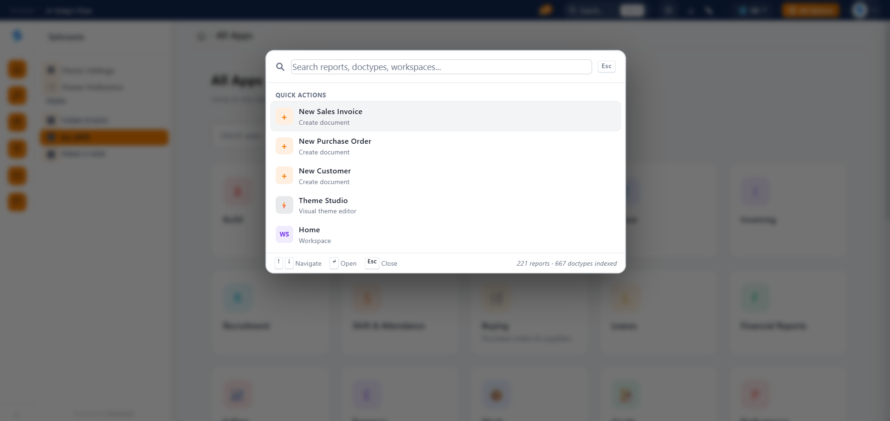
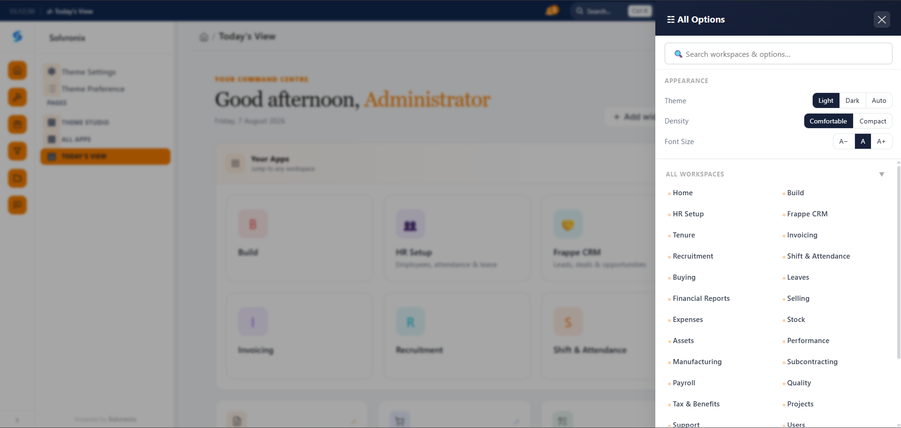

# Solvronix Desk

> A professional white-label theme for Frappe/ERPNext v16 that makes your ERP look and feel like a modern SaaS product.

[](https://cloud.frappe.io/marketplace/apps/solvronix_desk)

**Available on Frappe Cloud Marketplace** — install Solvronix Desk on your Frappe Cloud site in one click: [cloud.frappe.io/marketplace/apps/solvronix_desk](https://cloud.frappe.io/marketplace/apps/solvronix_desk)



---

## The Problem

ERPNext is powerful. But the default interface is overwhelming — too many menus, outdated design, and non-technical users struggle to find anything. Businesses reject ERPNext because it "doesn't look professional" or "is too hard to use."

**Solvronix Desk solves this.** Install it once and your ERPNext looks and feels like a tool people actually enjoy using — without touching a single line of your business logic.

---

## What You Get

### Command Palette — `Ctrl+K`
Press `Ctrl+K` from anywhere. Type what you're looking for — a document, a list, a setting — and navigate instantly. No menu hunting. No memorizing paths.

### White-Label Branding
Go to Theme Settings, enter your company name, upload your logo, pick your two brand colors. Save. The entire system — sidebar, navbar, login page, buttons — instantly becomes your brand.

### Quick Color Presets
Four one-click color presets appear above the color pickers in Theme Settings. Pick a preset — Brand Color and Accent Color update instantly. Includes Solvronix (Navy + Orange), Forest (Green + Gold), Midnight (Slate + Violet), and Plum (Purple + Amber). Use as-is or as a starting point before tweaking.

### Auto Color System
You set one brand color. The system automatically generates your complete color palette — backgrounds, hover states, borders, shadows — using CSS `color-mix()`. Change your brand color and everything updates instantly. No developer needed.

### Slim Icon Sidebar
A 64px icon rail instead of the default wide sidebar. Expands to 240px on click. Saves screen space, reduces visual clutter. State is saved per user.

### Dark Mode — Light / Dark / Auto
One click cycles between light, dark, and auto. Auto follows your operating system theme and switches live when the OS does. Both modes respect your brand colors. Works on every page.

### Display Density — Comfortable / Compact
A display density toggle. Compact mode tightens list rows, forms, and menus so power users see more data per screen. Per-user, with a site-wide default in Theme Settings.

### Font Size Control
Set a site-wide base font size (Small / Default / Large) in Theme Settings, and let each user fine-tune with A− / A / A+ from the All Options panel.

### Modern Login Page
A full-screen branded login experience with your company logo and colors, a slow-drifting ambient color backdrop generated from your brand palette, and a soft card entrance animation. First impression that sets the right tone for your team.

### Premium Motion & Depth
A polish layer across the whole desk: smooth, consistent transitions on every interactive element, layered card shadows with a subtle hover lift, gradient primary buttons with press feedback, and brand-colored keyboard focus rings. All animations respect your operating system's reduced-motion setting.

### Frosted-Glass Overlays
Dropdowns, modals, the command palette, and the notification and options panels render as translucent frosted surfaces with smooth pop-in entrances — while content cards stay solid and readable.

---

## Full Feature List

### Progressive Forms
Optional fields are hidden by default — forms look clean out of the box. A "Show More" toggle reveals them when needed. Reduces cognitive load for new users.

### Top Toolbar
A persistent top bar adds a live clock, a **Today's View** shortcut, the global search, dark mode toggle, and language switcher — all in one row, always visible.

### Language Switcher
A searchable dropdown lists all enabled system languages. Selecting one applies it instantly — no page reload required. Respects Frappe's translation layer.

### All Options Panel
A slide-in panel (triggered from the toolbar) shows every workspace grouped by category, plus an **Appearance** section with theme mode, density, and font-size controls. Lets users explore and personalize without navigating away from their current page.

### User Avatar Dropdown
Clicking the user avatar opens a dropdown with an installed apps grid, edit profile, reset workspace layout, and logout — all in one place.

### Module Switcher — `Ctrl+M`
Press `Ctrl+M` from anywhere to open a searchable workspace switcher. Type a module name and press Enter to jump to it instantly.

### Named Theme Presets
Save your current brand colors as a named preset from Theme Settings. Custom presets appear as swatches next to the built-in ones (Solvronix, Forest, Midnight, Plum) — switch your whole site's look in two clicks.

### Real-Time Theme Sync
When a System Manager saves Theme Settings, the color, branding, and font-size changes propagate instantly to all connected users via Frappe's realtime layer — no reload required.

### Refined Data & Charts
Tabular numerals keep columns of figures perfectly aligned in list views, report grids, and dashboard number cards. Charts get softer gridlines, hover focus on bars, and elevated tooltips that stay fully readable in dark mode.

### Details Everywhere
Keycap-styled keyboard hints, thin floating scrollbars, brand-tinted text selection, shimmer on loading placeholders, and a brand accent on the selected command-palette row.

### Setup Guide Banner
On first launch, a checklist banner guides System Manager users through the initial configuration steps: set company name, upload logo, choose brand colors. Dismisses permanently once complete.

---

## Screenshots

| Login Page | Today's View |
|:---:|:---:|
|  |  |

| Theme Settings | Dark Mode |
|:---:|:---:|
|  |  |

| Command Palette | Slim Sidebar |
|:---:|:---:|
|  |  |

---

## Requirements

| Requirement | Version |
|---|---|
| Frappe Framework | v16 |
| ERPNext | v16 (optional — works on any Frappe app) |
| Python | 3.10+ |
| Node | 18+ |

---

## Setup Your Branding (5 minutes)

Open **Theme Settings** — search for it with `Ctrl+K` or find it in the sidebar.

| Field | What it does |
|---|---|
| Company Name | Shown in the navbar — replaces "ERPNext" |
| Company Logo | Shown in the navbar and login page |
| Brand Color | Sets sidebar, navbar, and login page background |
| Accent Color | Sets buttons, active states, and highlights |

**Tip:** The **Quick Presets** row above the color pickers lets you apply a complete color pair in one click. Click any swatch → both fields update → click **Save**.

Click **Save** — the entire system updates instantly.

---

## How the Color System Works

You only need to pick **two colors**. Everything else is generated automatically.

```
Brand Color  →  sidebar background, navbar, login page
               + auto-generates: hover tints, border colors, page tint

Accent Color →  buttons, active sidebar item, highlights
               + auto-generates: button hover, pressed state
```

This means any company — whether their brand is navy, green, red, or black — gets a complete, consistent color system from just two color pickers.

**Example:** Set Brand Color to `#006B3C` (green). Sidebar becomes green, login page becomes green, page background becomes a very light green tint. Set it back to `#1B3F7E` (navy) and everything reverts. No code, no rebuild.

---

## Default Colors

| Color | Hex | Used For |
|---|---|---|
| Brand | `#1B3F7E` | Sidebar, navbar, login |
| Accent | `#F57C00` | Buttons, active items |
| Page Background | Auto-generated | Light tint of brand color |
| Cards / Forms | `#FFFFFF` | All content surfaces |

---

## Keyboard Shortcuts

| Key | Action |
|---|---|
| `Ctrl+K` / `Cmd+K` | Open command palette |
| `↑` `↓` | Move through results |
| `Enter` | Open selected item |
| `Esc` | Close palette |

---

## Compatibility

| Frappe Version | Status |
|---|---|
| v16 (all releases, v16.0 – v16.27+) | ✅ Fully supported |
| v15 | ⚠️ Not tested |
| v14 | ❌ Not supported |

Solvronix Desk tracks Frappe v16 API changes across minor releases — internal shims resolve renamed core methods automatically, so the app works on older production benches and the latest releases alike.

Works with ERPNext and any other Frappe-based application.

---

---

## License

MIT License — free to use, modify, and distribute commercially.

See [LICENSE](license.txt) for full details.

---

## About Solvronix

Solvronix builds Frappe/ERPNext products for businesses globally, based in Lahore, Pakistan.

- Website: [solvronix.com](https://solvronix.com)
- Email: sales@solvronix.com
- WhatsApp: +92 307 9484220

**Other products:**
- [Edvronix](https://solvronix.com/edvronix) — School management system built on ERPNext. Fee collection, attendance, timetables, parent portal, and more.

---

## Support

Something not working? Open an issue on [GitHub Issues](https://github.com/Solvronix/Solvronix-Desk/issues) or contact us directly.

- Email: sales@solvronix.com
- WhatsApp: +92 307 9484220

---

## Contributing

Pull requests are welcome. For major changes, please open an issue first to discuss what you'd like to change.
